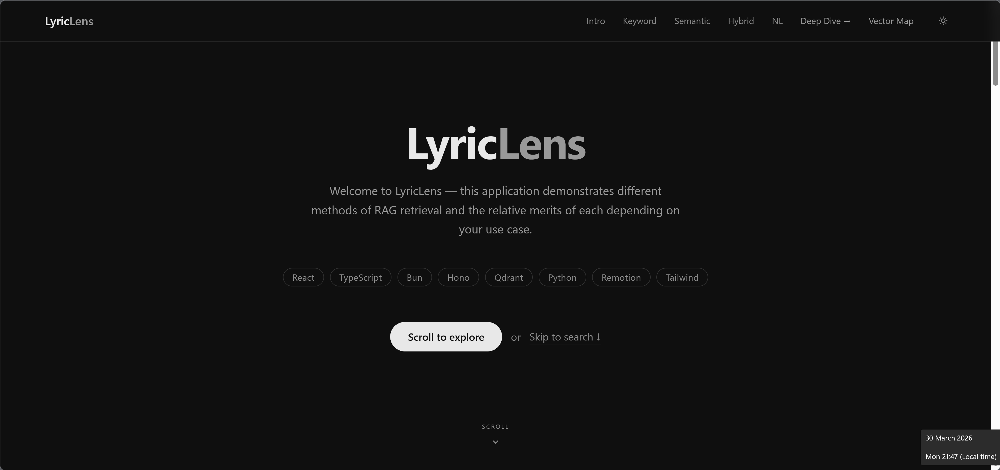
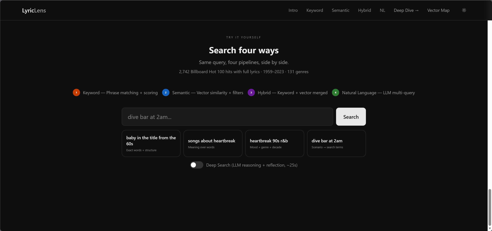
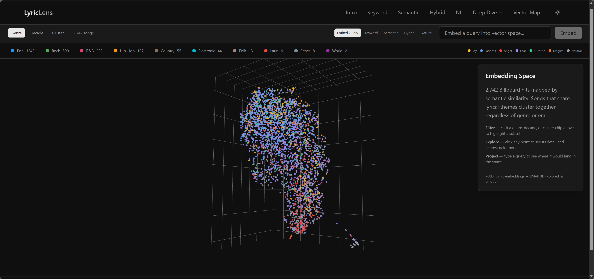
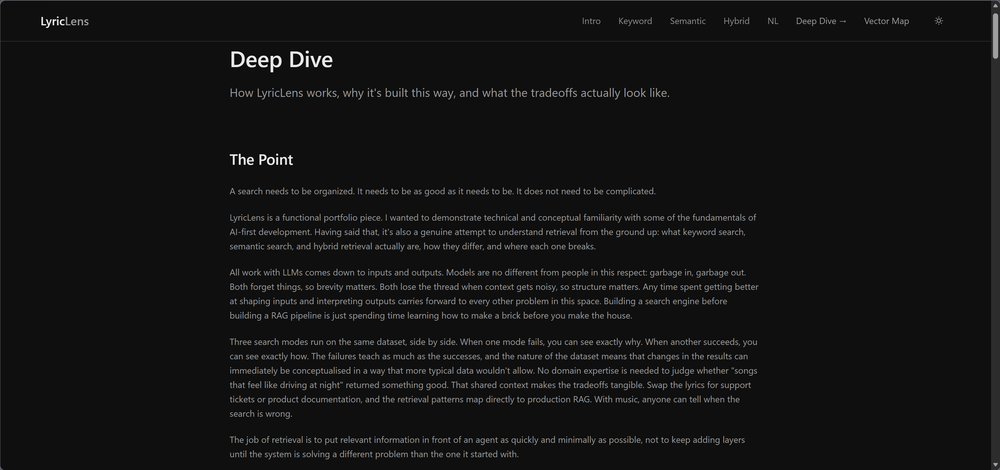
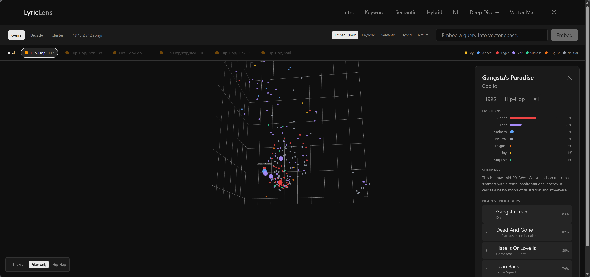

# LyricLens

Compare keyword, semantic, hybrid, and LLM-powered search across 2,742 Billboard hits. A hands-on demonstration of RAG retrieval tradeoffs — where each approach wins, where it breaks, and why.

<!-- **[Live demo →](https://lyriclens.example.com)** -->



## What this is

Three search modes run on the same dataset, side by side. When one fails, you can see exactly why. When another succeeds, you can see exactly how.

- **Keyword** — Phrase matching with n² sequence scoring. Finds "Be My Baby" as a title phrase, not three scattered words.
- **Semantic** — 768-dimensional vector similarity via nomic-embed-text-v1.5. Handles "songs that feel like driving at night" where keyword returns nothing.
- **Hybrid** — Runs both in parallel with confidence-adaptive blending (40/60 base, dynamic). Title and artist bonuses break the keyword ceiling on exact matches.
- **Natural language** — DeepSeek Chat generates three query interpretations, all run in parallel, DeepSeek Reasoner picks the best result set.

Each mode is deliberately limited. Keyword doesn't understand synonyms. Semantic can't filter by decade. The constraints are the point — they keep the tradeoffs visible and honest.

## Screenshots

| Search | Visualizer |
|--------|------------|
|  |  |

| Deep Dive | Song detail |
|-----------|-------------|
|  |  |

## Tech stack

| Layer | Technology |
|-------|-----------|
| Frontend | React 19, TypeScript, Vite, Tailwind CSS v4, Motion, Remotion, Plotly.js |
| Backend | Bun, Hono, Transformers.js + ONNX (local inference) |
| Embeddings | nomic-ai/nomic-embed-text-v1.5 — 768D, fp32, 8192-token context |
| Vector DB | Qdrant Cloud — two named vector spaces per song (lyrics + summary), cosine distance |
| LLM | DeepSeek Chat (orchestrator) + DeepSeek Reasoner (judge) |
| Pipeline | Python, sentence-transformers, scikit-learn, UMAP, qdrant-client |
| NLP | Compromise for entity extraction and query parsing |

## Dataset

2,742 songs from the Billboard Hot 100 (1950–2019) with full lyrics sourced from Genius. The raw dataset provides lyrics, titles, artists, and chart positions. Genre classifications, seven-dimension emotion scores, and two-to-three sentence profile summaries were generated using DeepSeek and transformer-based classifiers.

Each song is embedded twice in Qdrant: once from the lyrics and once from the summary. Semantic search queries both and keeps whichever scores higher.

**Source:** Derived from [Billboard Hot 100 Lyrics](https://www.kaggle.com/) on Kaggle, with lyrics from the Genius API. Genre classifications and emotion labels added during pipeline processing.

## Running locally

```bash
# Clone
git clone https://github.com/JimothySnicket/LyricLens.git
cd LyricLens

# Install
bun install

# Configure
cp .env.example .env
# Fill in QDRANT_URL, QDRANT_API_KEY, DEEPSEEK_API_KEY

# Run
bun run dev
# Frontend: http://localhost:5200
# Backend:  http://localhost:5201
```

The embedding model (~300MB, fp32) downloads automatically on first server start.

## Project structure

```
web/           React frontend (Vite)
server/        Bun + Hono API server
pipeline/      Python data processing and embedding scripts
screenshots/   App screenshots
```

## License

[MIT](LICENSE)

Song lyrics are sourced from Genius and remain the property of their respective rights holders. This project uses them under fair use for research and educational purposes. The dataset is not redistributed.
